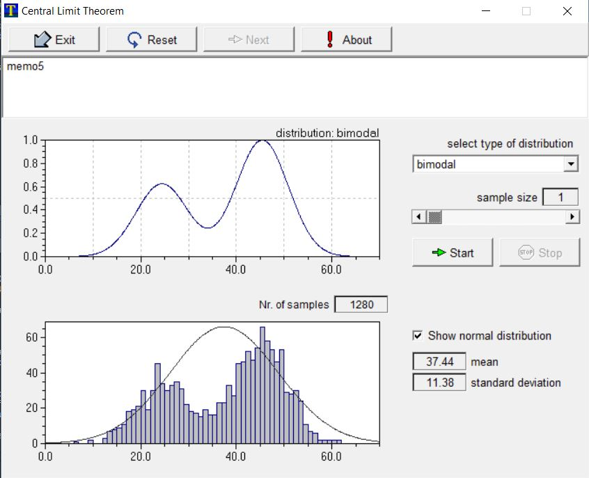
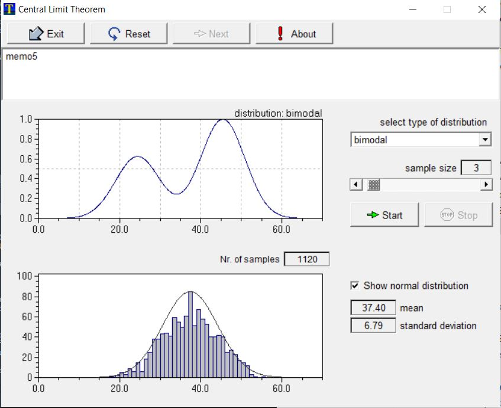

```{r, echo=FALSE}
library(tinytex)
```


## Q1. What size N seems to make the bimodal distribution look normal?
   
   * The greater the N, the more normal the distribution appears. The three images below show how the distribution becomes normal as N increases from 1 to 3 to 6. An N of 1 most prominently shows the bimodal distribution becacuse each sample's average equals the one sample. As the N increases, the distribution of each sample is the average of the N samples, so the distribution is distributed around the mean of the two modes. By about N = 5 or N = 6, the bimodal distribution appears normal.

  **N = 1**
```{r, out.width="250px", echo = FALSE}


```

  
  
  **N = 3**
```{r, out.width="250px", echo = FALSE}


```
 
  
  
  
  
  **N = 6**
```{r, out.width="250px", echo = FALSE}
knitr::include_graphics("bimodal_6.jpg")


```
  
  
  
  

## Q2. Monte Carlo simulation of the variance b
  
  For this part of the assignment, I used the MonteCalo package in R.
  The link which explains the functionality of this package can be found **[here](https://cran.r-project.org/web/packages/MonteCarlo/vignettes/MonteCarlo-Vignette.html)**
  
  
```{r, warning=FALSE, error=FALSE, message=FALSE, results='hide'}
#Setting up
#Loading package
library(MonteCarlo)
library(dplyr)
library(tinytex)

#The following recreates the estols2.ado file
estols2 <- function(n, xmean=0, x_sd=3, emean=0, e_sd=15, xcoef=3){

# The following steps are based on Lab E STATA code
# Create data for x, y, and e

# Create sample x [from STATA: "gen x=3*invnorm(uniform())"]
#(standard deviation = 3, mean = 0)
x <- rnorm(n, mean = xmean, sd = x_sd)

#Create sample e [from STATA: "gen e=15*invnorm(uniform())"
e <- rnorm(n, mean = emean, sd = e_sd)

#Create sample y
y <- xcoef*x+e

#create data frame to regress
df <- data.frame(y,x,e)

#output regression
model <- (lm(y~x, data = df))
coeflist <- model$coefficients[2] %>% unname

return(list("coeflist" = coeflist))
}

# Use the estols2 function to run Monte Carlo simulations with different parameters
# MonteCarlo takes 3 arguments: function, reps, and grid of parameters for function
# Define parameter grid
n_grid <- 300
param <- list("n"=n_grid)
estols2(n_grid)
MC_q2_a <- MonteCarlo(func = estols2, nrep = 200, param_list = param)

```
```{r, warning=FALSE, error=FALSE, message=FALSE}
#Summarize output with table and graph
library(ggplot2)
MC_2a <- MakeFrame(MC_q2_a)
tbl_2a <- tbl_df(MC_2a)
coef2a <- tbl_2a$coeflist
summary(coef2a)
sd(coef2a)

tbl_2a %>% ggplot()+geom_density(aes(x= coeflist)) + labs(title="(Q2a) Observed Distribution of B", subtitle = "N=300, reps=200, normal error distribution (based on estols2 parameters)", xlab="simulated coefficients", ylab="density")
```

 Q2, Part B: N=30, reps=300
```{r, warning=FALSE, error=FALSE, message=FALSE, results='hide'}
n_grid <- 30
param <- list("n"=n_grid)
estols2(n_grid)
MC_q2_b <- MonteCarlo(func = estols2, nrep = 300, param_list = param)

```
```{r, warning=FALSE, error=FALSE, message=FALSE}
#Summarize output with table and graph
library(ggplot2)
MC_2b <- MakeFrame(MC_q2_b)
tbl_2b <- tbl_df(MC_2b)
coef2b <- tbl_2b$coeflist
summary(coef2b)
sd(coef2b)

tbl_2b %>% ggplot()+geom_density(aes(x= coeflist)) + labs(title="(Q2b) Observed Distribution of B", subtitle = "N=30, reps=300, normal error distribution (based on estols2 parameters)", xlab="simulated coefficients", ylab="density")

```

 


